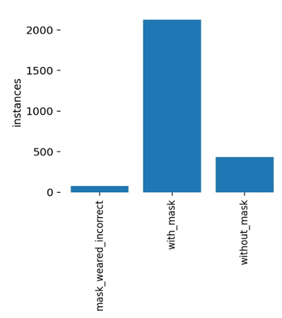
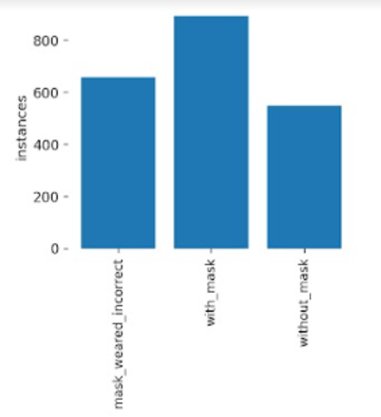
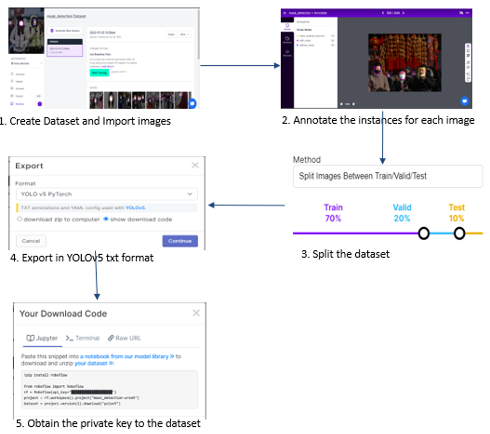
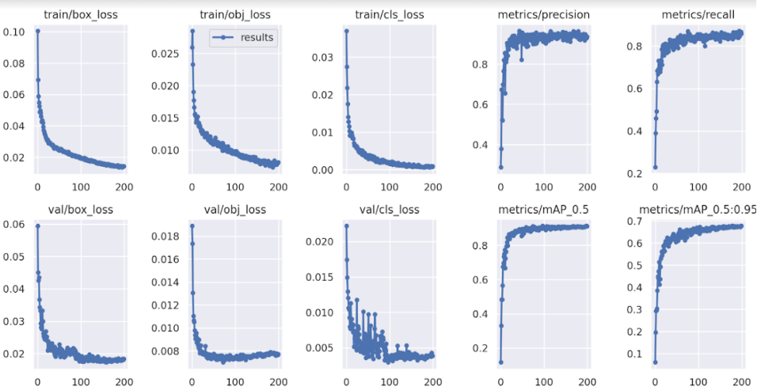

# Real Time Face Mask Detection using YOLOv5 (Team)

## Introduction

###  Motivation and Objective
Since the breakout of the deadly virus, COVID -19 has become the worst health problem that has affected the world population. However, wearing a face mask that inhibits the spread of droplets in the atmosphere can still help combat this pandemic. Therefore, we aim to develop a real-time face mask detector using deep learning techniques that can be deployed for public use. The design uses the latest Yolov5 and PyTorch for the implementation. The work mainly detects three types of wearing face masks; Person wearing the mask, Person not wearing the mask, and Person not correctly wearing the mask.

## Project Execution

### 2.1 Data Acquisition
- The data set is taken from Kaggle and annotated using Roboflow
- The data set is number of images with 3 categories (“with mask” ,”without mask”, ”mask worn incorrectly”)

### 2.2 Training Methodology
- The dataset was divided into 3 parts train / validate /test in the ratio of (70/20/10)%.
- ‘train.py’ file included in YOLOv5 model was used to train the model.
- 200 epochs were used to train the model.
- Image size used is 416 x 416 .

#### 2.2.1 About YOLOv5
- YOLO (You Only Look Once)
- Open-source project by Ultralytics
- Based on YOLO model, pre-trained on COCO dataset
- Uses PyTorch, suitable for real-time object detection
- Requires minimal computational resources

### 2.3 Workflow
- Installing dependencies required by YOLOv5
- Downloading annotated data from roboflow
- Reviewing the number of classes
- Training the data
- Custom loading the model
- Testing on a random image from google.com
- Implementing real time mask detection using webcam

## Results

### 3.1 Data Preparation
#### 3.1.1 Handling Imbalanced Data
Using only one dataset resulted in an imbalanced model as the number of instances per class heavily varied from class to class

#### 3.1.2 Data Annotation on Roboflow
Utilized Roboflow for YOLOv5 TXT format annotation, resulting in a final balanced dataset.

### 3.2 Modeling
- Box loss denotes the performance of the algorithm with reference to the bounding box.
- The Objectness loss represents the probability that an instance exists in a proposed region of interest.
- The classification loss gives knowledge of the algorithm predicting the right class of a given instance.
- The best PR curve threshold is one that results in the precision and recall being closest to 1.
- Therefore, from the key, of the PR curve shown in the figure, it can be seen that the precision-recall threshold is fairly high for all of the classes.
- A confusion matrix is used to evaluate the performance of a classification model. The figure above depicts that the true positive rate is high (0.92 for mask weared incorrect, 0.90 for with mask and 0.79 for without mask) for all three classes. This rate defines the proportion of the predicted classes that were actually those classes.

 
 
 

### 3.3 Final Product
Successfully classified real-time instances of mask wearing, not wearing, and incorrect wearing.

